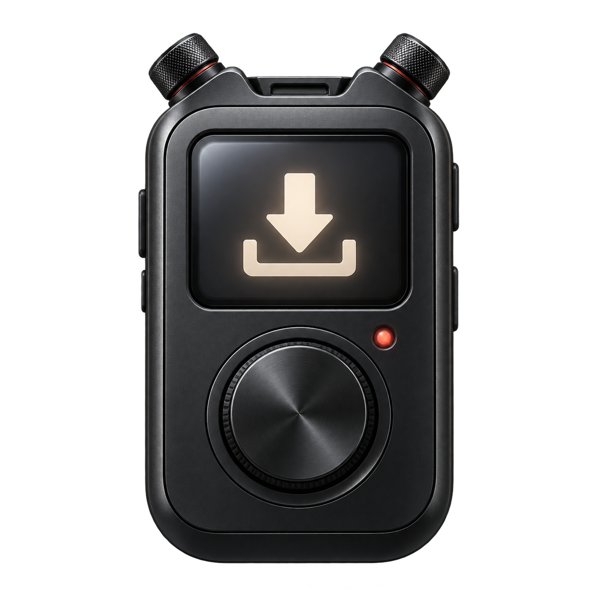

<p align="center"></p>

# Workshop Device

**Steam Workshop のアイテムを、指定したフォルダーにダウンロード。** MOD、マップなどのリンクを貼り付け、保存先を選んでダウンロードします。Workshop Device がゲームを自動判別し、ファイルを個別のフォルダーに保存します。Windows ネイティブアプリなので、SteamCMD のコマンド入力は不要です。

[English](../README.md) · [Português](README.pt-BR.md) · **日本語**

[最新版をダウンロード](https://github.com/whisperbtw/workshop-device/releases/latest) · [プロジェクトサイト](https://whisperbtw.github.io/workshop-device/) · [貢献ガイド](CONTRIBUTING.ja.md) · [問題を報告](https://github.com/whisperbtw/workshop-device/issues)

上の画像はアプリのアートワークであり、スクリーンショットではありません。

## インストール

Windows 10/11 x64、インターネット接続、GPUI の描画に対応したグラフィックスドライバーが必要です。

- **インストーラー:** Releases から `Workshop-Device-Setup-1.2.0.exe` をダウンロードします。現在の Windows ユーザー向けにインストールされ、スタートメニューのショートカットとアンインストーラーが作成されます。デスクトップのショートカットは任意です。管理者権限は不要です。
- **ポータブル版:** `Workshop-Device-1.2.0-windows-x64.zip` を展開し、`Workshop-Device.exe` を開きます。付属のライセンス通知も保管してください。
- `SHA256SUMS.txt` に配布ファイルの SHA-256 ハッシュがあります。`Get-FileHash .\Workshop-Device-Setup-1.2.0.exe -Algorithm SHA256` で確認できます。

配布するアプリにはコード署名がありません。署名証明書の購入は予定していません。Windows が発行元不明の警告を表示する場合があります。このリポジトリの Releases からダウンロードしてください。

## 使い方

1. Workshop Device を開きます。
2. Workshop リンク欄に個別アイテムの HTTPS リンクを貼り付けます。Steam Workshop のアイテムページからリンクをコピーしてください。数値の Workshop ID も使えます。
3. 小さなフォルダーボタンで保存先を選択します。
4. 大きなダウンロードボタンを押します。画面に処理段階、経過時間、エラーが表示されます。
5. 完了後、保存済みのフォルダーを開くボタンからファイルを確認します。

初回利用時に公式 SteamCMD が自動でダウンロード・準備されます。初期保存先は Windows の Downloads 内の `Workshop` フォルダーです。書き込み可能な別のフォルダーも選べます。完了したダウンロードは新しい `<workshop-id>-<timestamp>` サブフォルダーに保存され、既存のダウンロードは上書きされません。

上部のグリップをドラッグするとウィンドウを移動できます。刻印風の **−** は最小化、**×** は終了です。ダウンロード中は中央ボタンが停止ボタンになります。アプリを閉じると、このアプリの SteamCMD プロセスも終了します。

Steam がアイテムを特定すると、画面に**ゲーム名とアイテム名**を表示します。**依存アイテムは含まれません**から Workshop ページを開き、必要なアイテムとインストール手順を確認できます。依存アイテムは自動ダウンロードされません。

確認できた情報に応じて、アクセス鍵の不足、アクセス拒否、接続問題、アイテムの利用不可、保存失敗を区別します。SteamCMD が詳細を返さない場合は原因不明と表示します。**診断情報をコピー**すると、アプリのバージョン、エラー分類、取得済みのアイテムとゲームの ID をコピーします。個人のファイルパスや Steam の生ログは含みません。

## 対応範囲

- SteamCMD の匿名ダウンロードを許可する各ゲームの個別 Workshop アイテムに対応します。Steam のメタデータからゲームを自動判別するため、特定のゲームへの制限やゲーム選択はありません。
- コレクション、無効なリンク、有効なゲーム ID がないアイテム、利用できないアイテムは受け付けません。
- Steam でサブスクライブしても、このアプリのダウンロードは開始されません。リンクを貼り付けてください。
- Steam アカウントの認証や所有権が必要なアイテムもあります。このバージョンには Steam ログイン機能がなく、それらはダウンロードできません。
- アイテムのゲームへのインストールや有効化は行いません。作者の手順に従い、ゲームのバージョンとの互換性を確認してください。
- SteamCMD が提供するアクセスを使用し、制限を回避する機能はありません。

[検証したアイテムと結果](COMPATIBILITY.md)をご覧ください。対応状況は各アイテムと Steam のアクセス条件によって異なります。

## ファイル・プライバシー・トラブル対応

設定、SteamCMD、Workshop キャッシュ、保存記録、ログは `%LOCALAPPDATA%\PZWorkshopDownloader` に保存されます。更新時に設定とキャッシュを保持するため、旧キャッシュ名を引き続き使用します。指定した保存先にはアイテムのファイルがコピーされます。中断されたコピーには `.partial` の一時フォルダーが残る場合があります。これは完了したダウンロードではありません。

Steam パスワードや API キーは要求しません。アプリは Steam のメタデータ API と公式 SteamCMD 配布サービスに接続し、SteamCMD は Steam のサーバーに接続します。アプリ独自の利用分析サービスはありません。

エラーはアプリ内の画面に表示されます。失敗時はアイテムが公開されているか、そのゲームが SteamCMD の匿名アクセスを許可するかを確認してください。保存エラーの場合はフォルダーの権限と空き容量を確認します。SteamCMD 自身のログはキャッシュ内にあります。

アンインストールでアプリとショートカットが削除されますが、ダウンロードしたファイル、キャッシュ、設定は残ります。設定をリセットする場合はアプリを閉じてからキャッシュフォルダーを手動で削除してください。

## 設定と言語

左上の歯車で同じ画面が設定画面に切り替わります。**English**、**Português**、**日本語** から選べます。初回起動時は Windows の表示言語を検出し、対応していない言語の場合は英語になります。手動で選んだ言語は保存されます。

完了後にフォルダーを開く設定は任意で、初期状態では無効です。設定は自動保存されます。戻る矢印または中央ボタンで元の画面に戻れます。設定画面を開いてもダウンロードは中断されません。

## ビルドとパッケージ作成

Rust **1.96.1 以降**、MSVC ツールチェーン、Visual Studio C++ Build Tools、Windows SDK をインストールします。Windows x64 上で実行してください。

```powershell
git clone https://github.com/whisperbtw/workshop-device.git
cd workshop-device
cargo fmt --check
cargo clippy --locked --all-targets -- -D warnings
cargo test --locked
cargo build --release --locked
```

実行ファイルは `target\release\workshop-device.exe` です。ビルド時にアイコンとファイル情報が埋め込まれます。

[Inno Setup 6](https://jrsoftware.org/isinfo.php) をインストールして実行します。

```powershell
pwsh -File scripts/package.ps1
```

パッケージとチェックサムは `dist\` に出力されます。CI は整形、Clippy、テスト、依存関係のアドバイザリーを確認します。`v*` タグを付けるとパッケージが作成されます。タグのバージョンは Cargo.toml と一致する必要があります。タグのビルドに成功すると GitHub Release が公開されます。

## 構成

| パス | 内容 |
| --- | --- |
| `src/ui.rs`、`buttons.rs`、`device.rs`、`native.rs` | GPUI 画面、押下アニメーション、フレームなしウィンドウ |
| `src/backend.rs`、`steamcmd.rs`、`install.rs` | 入力検証、SteamCMD の管理、安全なコピー |
| `src/session.rs`、`model.rs`、`i18n.rs` | 状態、設定、翻訳 |
| `assets/` | アイコンとアートワーク |
| `installer/`、`scripts/`、`.github/workflows/` | パッケージ作成、検証、リリース |
| `docs/` | 翻訳ドキュメントと公開サイト |

## 貢献を歓迎します

**このプロジェクトは貢献を受け付けています。** 不具合修正、翻訳、アクセシビリティ、テスト、ネイティブ UI の改善を歓迎します。Pull Request を送る前に [貢献ガイド](CONTRIBUTING.ja.md) を読んでください。英語とポルトガル語のガイドもあります。

## ライセンスと謝辞

コードとアートワークは [MIT](../LICENSE) ライセンスで配布します。依存関係にはそれぞれのライセンスが適用され、配布物には [THIRD-PARTY-NOTICES.html](../THIRD-PARTY-NOTICES.html) が付属します。アイコンは画像生成 AI で作成され、プロンプトは [assets/IMAGE.md](../assets/IMAGE.md) に記載しています。

[GPUI](https://www.gpui.rs/)、[gpui-component](https://github.com/longbridge/gpui-component)、公式 [SteamCMD](https://developer.valvesoftware.com/wiki/SteamCMD) を使用しています。SteamCMD は実行時に取得され、配布パッケージには含まれません。Valve や各ゲームの開発元とは関係のないコミュニティプロジェクトです。SteamCMD の使用は Valve による承認を意味しません。Steam の規約と各アイテムのライセンスを守ってください。
